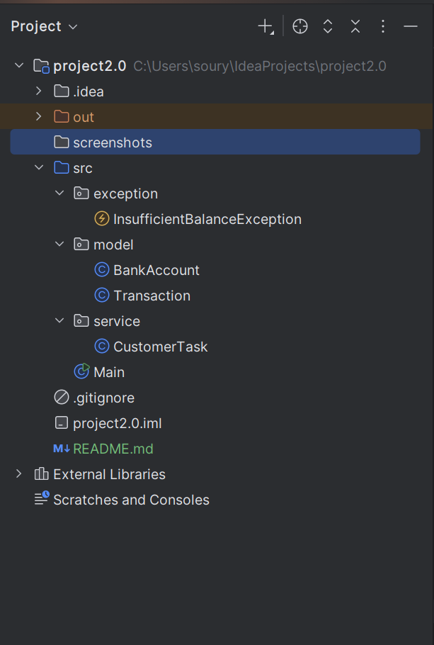
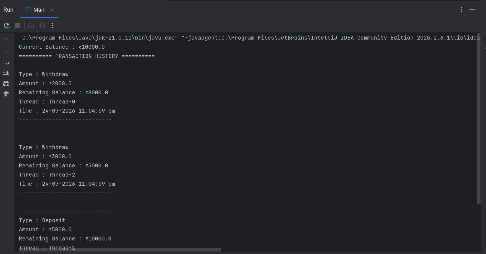
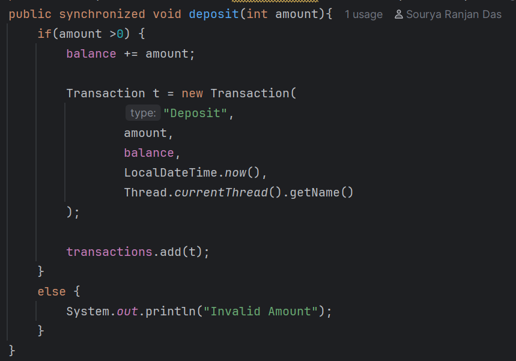

# 🏦 Multithreaded Banking System

A thread-safe Banking System built using **Java** to simulate concurrent banking operations. This project demonstrates **Object-Oriented Programming, Multithreading, Synchronization, Collections, and Custom Exception Handling**.

---

## 📸 Project Preview

### 📁 Project Structure



### 💻 Console Output



### 🏦 BankAccount Implementation



---

## 🚀 Features

- 💰 Deposit Money
- 💸 Withdraw Money
- 🧵 Multithreaded Customer Operations
- 🔒 Thread-safe Transactions using `synchronized`
- 📜 Transaction History
- ⚠️ Custom Exception Handling
- 🕒 Formatted Date & Time
- 📦 Clean Package Structure

---

## 🛠️ Technologies Used

- Java
- Object-Oriented Programming (OOP)
- Multithreading
- Synchronization
- Collections (`ArrayList`)
- Exception Handling
- IntelliJ IDEA
- Git & GitHub

---

## 📂 Project Structure

```text
src
├── exception
├── model
├── service
└── Main.java
```

---

## ▶️ How to Run

```bash
git clone https://github.com/Souryakiit/Multithreaded-Banking-System.git
```

Open the project in IntelliJ IDEA and run `Main.java`.

---

## 📚 Concepts Practiced

- Object-Oriented Programming
- Java Threads
- Synchronization
- Race Condition Prevention
- Collections
- Custom Exceptions
- Method Overriding (`toString()`)
- Package Organization

---

## 👨‍💻 Author

**Sourya Ranjan Das**

GitHub: https://github.com/Souryakiit